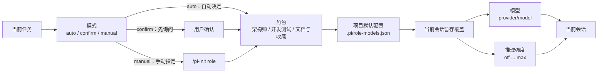

# pi-init

Pi 扩展：为项目生成 AI Coding 协作上下文，并提供角色编排。

## 功能

- 生成项目级 `AGENTS.md`、记忆文档和 `.pi/skills/<slug>/SKILL.md`。
- 通过统一的 `/pi-init` 控制中心完成初始化、角色配置和模型切换。
- 根据任务在架构、开发测试、文档提交三类角色之间切换模型。
- 支持 `auto`、`confirm`、`manual` 三种角色切换模式。
- 提供项目级任务工作流策略，默认 `workflowMode: "auto"`：`off` 拒绝新规划，`on` 始终编排，`auto` 对不超过 2 个任务的规划跳过编排并由当前架构角色直接顺序执行；可通过 `/pi-init config workflow` 选择。兼容旧配置中的 `workflowEnabled`，缺失 `workflowMode` 时 `true/false` 映射为 `on/off`。
- 工作流执行器默认是 `local`；可选择通过 `pi.events` 使用已安装的 `@tintinweb/pi-subagents` 顺序委派当前任务，主会话仍拥有唯一的工作流状态。
- 未进入 `task_workflow` 的普通外部 Agent 执行会在 TUI 中显示开始时间、结束时间和总耗时报告，并与工作流任务完成报告分开。
- 自动模式在真实跨角色且上下文使用率达到 50% 时，于 agent 完全 settled 后压缩上下文并自动继续任务。
- 记录项目宿主环境和平台相关命令约定。

## 安装与启动

直接在本仓库启动扩展：

```bash
pi --no-extensions -e ./extensions/init-project.ts
```

然后在 Pi 中执行：

```text
/pi-init
```

可以直接从 GitHub 安装为 Pi package：

```bash
pi install https://github.com/CGOSU/pi-init
```

也可以使用 Git shorthand：

```bash
pi install git:github.com/CGOSU/pi-init
```

如果要启用 `subagents` 执行器，还需要在同一个 Pi 环境中单独安装并启用第三方扩展；pi-init 不会复制或声明该依赖：

```bash
pi install npm:@tintinweb/pi-subagents
```

未安装该扩展时请保持 `workflowExecutor: "local"`；subagents 模式会在缺少 RPC 时安全阻塞当前任务。

仅当前会话临时使用：

```bash
pi -e https://github.com/CGOSU/pi-init
```

本地开发时，也可以从当前目录安装：

```bash
pi install .
```

`init_project` 工具的 `targetDir` 默认为当前工作目录，支持 `dryRun: true` 预览而不写入文件。

### 可选：用量统计

仓库提供跨平台的 `pi-usage` 命令，用于查看 Pi 的模型用量：

Windows PowerShell：

```powershell
pwsh -File .\scripts\install-launchers.ps1
pi-usage
```

POSIX shell（Linux/macOS/WSL）：

```bash
sh ./scripts/install-launchers.sh
pi-usage
```

- `pi-usage` 默认查询 DuckDB；首次查询、距离上次检查超过 1 小时或跨自然日时，会自动扫描并增量导入 session JSONL。追加写入只读取已保存 checkpoint 之后的新字节；文件截断、改写或尾部校验失败时自动回退为全量重建。使用 `pi-usage --update` 可强制立即检查，之后可传入 `YYYY-MM-DD` 查询指定日期，也可用 `--db <路径>` 指定数据库。默认数据库为 `~/.pi/agent/pi-usage.duckdb`，未安装 DuckDB 时会自动安装到用户目录。
- `pi-usage` 还显示活跃时长、模型等待时长和 session 跨度；Models 表按模型显示 `Avg TPS`（`输出 token 总数 / 有效生成秒数`），采用加权吞吐量而不是简单平均；没有 `pi-token-speed` 采样的历史模型显示 `--`。Overview、Models 和 Time 使用带边框的对齐表格，并额外显示按模型总 token 缩放的柱状图及整体缓存占比（`(Cache R + Cache W) / Total`）。交互终端默认使用 ANSI 颜色，设置 `NO_COLOR=1` 可关闭。活跃时长只连接间隔不超过 5 分钟的事件，避免空闲时间被计入。
- `--update` 会强制扫描 session JSONL 并更新 DuckDB 派生表；自动检查只在上述缓存过期时执行，未过期的普通查询直接读取数据库。TTY 下手动更新和首次/过期自动检查都会显示扫描、追加、重建、移除及重算日期摘要；非 TTY 保持原有报表输出，不额外写入进度信息。session 很多或首次自动安装 DuckDB 时会短暂等待。
- 更新结束后在当前 Pi 会话执行 `/reload`，或重启 Pi，使已加载扩展使用新文件。
- 安装器会把启动器放到 Pi 所在的可执行目录；POSIX 若无写权限则使用 `${XDG_BIN_HOME:-$HOME/.local/bin}`，并提示将其加入 `PATH`。
- Pi package 的 `postinstall` 会在 `pi update --extensions` 更新完成后自动刷新 `pi-usage` 启动器；如果 `pi` 不在 `PATH` 中或 npm 禁用了 lifecycle scripts，脚本会跳过并提示重新执行安装器。
- 这些辅助命令是可选工具，不会修改系统全局环境变量；换电脑时从仓库重新执行安装器即可。

## 生成内容

```text
<project-root>/
├── AGENTS.md
├── docs/
│   ├── clean-code.md
│   ├── current-state.md
│   ├── decisions.md
│   ├── session-log.md
│   └── pitfalls.md
└── .pi/
    ├── agents/
    │   ├── pi-init-developer-test.md
    │   └── pi-init-docs-commit.md
    ├── role-models.json
    ├── skills/
    │   └── <project-slug>/
    │       └── SKILL.md
```

初始化提供两条路径：快速路径自动读取 `package.json`、锁文件和目录名，只需一次确认；高级路径才会询问项目名称、语言、项目定位、测试命令和 Skill 名称。当前项目初始化完成后会自动 reload。生成的 `AGENTS.md` 会要求先读取随模板生成的 `docs/clean-code.md`，并记录当前 Pi 宿主系统、CPU 架构和平台命令约定；如果项目实际运行在 WSL、容器或远程主机，应重新执行检测。

默认模板面向 CGOSU 工作流，包含团队知识库和 Git 身份规则。其他团队使用前，请修改：

- `templates/AGENTS.md`
- `templates/en/AGENTS.md`

## 角色编排

项目级 Skill 按交付物选择角色：

| 角色 | 默认模型 | 推理强度 |
| --- | --- | --- |
| 架构师 | `openai-codex/gpt-5.6-sol` | `max` |
| 开发测试工程师 | `openai-codex/gpt-5.6-luna` | `max` |
| 文档与收尾工程师 | `openai-codex/gpt-5.6-luna` | `medium` |

角色默认配置保存在项目的 `.pi/role-models.json`：

- `auto`：自动切换。
- `confirm`：切换前询问。
- `manual`：只允许用户手动切换。
- `/pi-init role` 和 `switch_role` 只切换当前会话，不写项目配置。
- `/pi-init config [角色]` 与 `/pi-init config workflow` 只暂存当前会话变更；执行 `/pi-init save`（保存角色配置）后才写入 `.pi/role-models.json`。

自动模式仅在实际跨角色且上下文使用率达到 50% 时额外触发一次压缩；压缩会保留目标、决策、进度、文件、验证结果和下一步，成功后自动继续当前任务。会话恢复时会根据当前模型和推理强度唯一匹配并恢复角色。`confirm`、`manual`、首次选角、同角色重复切换和未知上下文不会额外触发。

角色、模型和模式的关系：



用户只需记住一个入口：

```text
/pi-init
```

控制中心提供快速初始化、高级初始化、角色与模型配置、独立的工作流策略配置、角色切换和模式切换；主状态摘要会显示当前工作流策略与执行进度。熟悉命令行时也可以直接使用：

```text
/pi-init init [目录]
/pi-init advanced [目录]
/pi-init role <architect|developer-test|docs-commit>
/pi-init config [architect|developer-test|docs-commit]
/pi-init config workflow
/pi-init save
/pi-init mode <auto|confirm|manual>
```

任务工作流默认使用 `workflowMode: "auto"`。使用 `/pi-init config workflow` 在当前会话暂存 `off`、`on` 或 `auto`，执行 `/pi-init save` 后才写入项目配置；也可以直接编辑 `.pi/role-models.json` 的顶层 `workflowMode` 字段：`off` 不创建新规划，`on` 始终创建工作流，`auto` 对不超过 2 个任务的规划返回绕过提示、不持久化状态、不调度角色，超过 2 个任务才进入编排；已开始的工作流仍可查看和收尾。旧项目缺失 `workflowMode` 时，`workflowEnabled: true/false` 分别兼容为 `on/off`，两者同时存在时以 `workflowMode` 为准。

`workflowExecutor` 同样位于 `.pi/role-models.json` 顶层，默认值为 `local`，可设为 `subagents`。配置变更先只影响当前会话，执行 `/pi-init save` 后才持久化；活动工作流会持久化创建时的执行器，之后配置不会把已有工作流切换到另一执行器。

### Provider 锁定

项目默认使用 fail-closed Provider 策略。`.pi/role-models.json` 缺少策略时，等价于：

```json
"providerPolicy": {
  "mode": "locked",
  "allowedProviders": ["openai-codex"]
}
```

该策略同时约束角色模型、`/model` 选择与循环、会话恢复、工作流自动切换和 Agent 子代理。Agent 省略 `model` 时显式继承当前允许模型；`haiku`、`sonnet` 等未带 `provider/` 的模糊名称，以及 `openrouter/...` 等未允许模型，会在 spawn 前拒绝。需要其他 Provider 时，必须显式编辑并保存 `.pi/role-models.json` 的 `allowedProviders`，同时让所有角色模型使用允许列表中的 Provider；如果变更来自会话暂存，再执行 `/pi-init save`。不会自动 fallback，也没有临时解锁入口。

OpenRouter 调用的根因不是 Codex 失败后的 fallback，而是 Agent 子代理调用显式传入了 `haiku`/`sonnet`，或 agent 类型默认模型经模糊解析落到了 OpenRouter。Provider 锁不修改全局 `auth.json`，只在当前项目会话中限制模型来源。

Pi 0.84 的 `model_select` 目前是切换后的通知事件，因此扩展会立即恢复到上一个或配置中的安全模型，并在 `session_start`、输入和 provider 请求前再次校验；未来 Pi 增加可取消的 `before_model_select` 后，可进一步从选择源头拒绝。

每个任务完成时会输出精简的任务报告，包含任务、角色、开始/结束时间、总耗时、摘要和验证结果。总耗时从任务实际进入 `in_progress` 的时间开始计算，到任务完成时间结束；旧版状态若没有开始时间，会明确显示耗时不可用，不会伪造时间。

仅当最后一个任务完成、工作流进入 `completed` 时，才会额外输出统一的精简工作流报告，包含目标、进度、任务摘要、整体开始/结束时间、总耗时和汇总验证。规划、架构审阅等待和任务之间的调度等待不计入整体执行耗时；不调用模型生成主观内容。local 与 `subagents` 执行器使用相同格式。中间任务仍只显示任务级报告，不冒充工作流整体完成。报告中的开始/结束时间统一显示为东八区 `YYYY-MM-DD HH:mm:ss+08:00`。

未走 `task_workflow` 的普通外部执行也会显示“普通执行时间报告”，字段包括来源、开始时间、结束时间、总耗时和计时口径。它只跟踪 `interactive` 或 `rpc` 输入，时间边界是首次 `agent_start` 到最终 `agent_settled`；这只表示本次 Agent 执行，不等同于工作流任务或业务任务完成。活动工作流、subagents 和扩展隐藏续跑不会重复生成普通记录。报告使用不进入 LLM 上下文的 session custom entry 持久化；reload、会话切换或中断时不会补造未完成记录。

`/pi-init mode`、`/pi-init role`、`switch_role` 和 `/pi-init config` 的运行时变更只影响当前会话；只有明确执行 `/pi-init save` 才会把暂存角色配置写入项目文件。Pi 原生 `/model` 和 `Shift+Tab` 仍可用于临时切换，角色自动切换以当前会话配置为准。

### subagents 顺序执行器边界

启用 `workflowExecutor: "subagents"` 后，pi-init 通过 `pi.events` RPC 发送 `subagents:rpc:spawn`，并只顺序委派当前就绪任务。子代理在共享工作区运行，不创建 worktree、不并行、不合并分支、不自动提交或推送；主会话是 `task_workflow` 状态的唯一写入者，子代理不能调用该工具。

子代理完成事件必须携带符合 `pi-init/task-result@1` 的严格 JSON 结果；只有 `outcome: "complete"` 且包含真实验证记录的结果才会完成任务。无效结果、失败事件、缺少 pi-subagents 扩展、RPC 错误或超时都会安全阻塞任务，而不会猜测性推进。

reload 不会自动重生已经绑定的非终态子代理，以避免共享工作区并发写入。持久化的 request/agent 绑定只用于状态展示和人工恢复；取消或阻塞活动任务时，pi-init 会发送停止请求，但不会伪造任务完成，必要时仍需人工确认代理状态。

### 工作流运行时版本不一致

如果创建工作流时看到 `(0, _roles.shouldOrchestrateWorkflow) is not a function`，说明正在运行的扩展和 `src/roles.js` 不是同一版本，通常是 Pi 仍加载旧的 Git package 或 reload 前的模块缓存。执行：

```bash
pi update --extensions
```

然后在当前 Pi 会话执行 `/reload`；本地开发直接重启 Pi，并使用同一份 `extensions/init-project.ts` 与 `src/roles.js`。pi-init `1.0.4` 起会把该情况转换为可操作的错误提示，不会继续以不确定的策略创建工作流。

## 全局协作规则

如果所有项目都需要遵守同一套主机规则，可使用 Pi 全局上下文文件：

```text
~/.pi/agent/AGENTS.md
```

`settings.json` 主要用于配置，不适合承载自然语言协作规则。

## 检查

```bash
npm test
```
