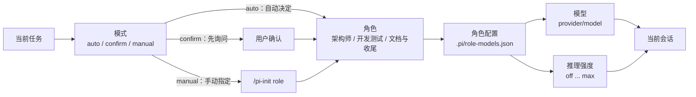

# pi-init

Pi 扩展：为项目生成 AI Coding 协作上下文，并提供角色编排与并行开发子代理。

## 功能

- 生成项目级 `AGENTS.md`、记忆文档和 `.pi/skills/<slug>/SKILL.md`。
- 通过统一的 `/pi-init` 控制中心完成初始化、角色配置和模型切换。
- 根据任务在架构、开发测试、文档提交三类角色之间切换模型。
- 支持 `auto`、`confirm`、`manual` 三种角色切换模式。
- 自动模式在真实跨角色且上下文使用率达到 50% 时，于 agent 完全 settled 后压缩上下文并自动继续任务。
- 通过隔离 Git worktree 并行运行开发测试子代理。
- 记录项目宿主环境、阶段耗时、token/cache/cost 和自动重试指标。

## 安装与启动

直接在本仓库启动扩展：

```bash
pi --no-extensions -e ./extensions/init-project.ts
```

然后在 Pi 中执行：

```text
/pi-init
```

可以直接从 GitHub 安装为 Pi package：

```bash
pi install https://github.com/CGOSU/pi-init
```

也可以使用 Git shorthand：

```bash
pi install git:github.com/CGOSU/pi-init
```

仅当前会话临时使用：

```bash
pi -e https://github.com/CGOSU/pi-init
```

本地开发时，也可以从当前目录安装：

```bash
pi install .
```

`init_project` 工具的 `targetDir` 默认为当前工作目录，支持 `dryRun: true` 预览而不写入文件。

### 可选：离线启动与扩展更新

如果全局设置了 `PI_OFFLINE=1`，Pi 启动时不会访问网络，也不会检查扩展更新。仓库提供跨平台启动器，把启动和升级分开：

Windows PowerShell：

```powershell
pwsh -File .\scripts\install-launchers.ps1
pi-fast
pi-update
pi-usage
```

POSIX shell（Linux/macOS/WSL）：

```bash
sh ./scripts/install-launchers.sh
pi-fast
pi-update
pi-usage
```

- `pi-fast` 只为当前 Pi 子进程设置 `PI_OFFLINE=1`，日常启动不联网。
- `pi-update` 只为更新子进程清除 `PI_OFFLINE`；无参数更新所有扩展，也可传入具体包源。
- `pi-usage` 默认查询 DuckDB；首次查询、距离上次检查超过 1 小时或跨自然日时，会自动扫描并增量导入 session JSONL；使用 `pi-usage --update` 可强制立即检查，之后可传入 `YYYY-MM-DD` 查询指定日期，也可用 `--db <路径>` 指定数据库。默认数据库为 `~/.pi/agent/pi-usage.duckdb`，未安装 DuckDB 时会自动安装到用户目录。
- `pi-usage` 同时统计关联 Git 仓库的当天 commit 变化，以及当前已跟踪文件的未提交变化；未提交变化不能精确归因到某个模型。
- `pi-usage` 还显示活跃时长、模型等待时长和 session 跨度；Overview、Models、Time 和 Git changes 均使用带边框的对齐表格，交互终端默认使用 ANSI 颜色，设置 `NO_COLOR=1` 可关闭。活跃时长只连接间隔不超过 5 分钟的事件，避免空闲时间被计入。
- `--update` 会强制扫描 session JSONL、更新 DuckDB 派生表并执行 Git 查询；自动检查只在上述缓存过期时执行，未过期的普通查询直接读取数据库。session 很多或首次自动安装 DuckDB 时会短暂等待，交互终端会显示手动更新进度提示。
- 更新结束后在当前 Pi 会话执行 `/reload`，或重启 Pi，使已加载扩展使用新文件。
- 安装器会把启动器放到 Pi 所在的可执行目录；POSIX 若无写权限则使用 `${XDG_BIN_HOME:-$HOME/.local/bin}`，并提示将其加入 `PATH`。
- 这些辅助命令是可选工具，不会修改系统全局环境变量；换电脑时从仓库重新执行安装器即可。

## 生成内容

```text
<project-root>/
├── AGENTS.md
├── docs/
│   ├── clean-code.md
│   ├── current-state.md
│   ├── decisions.md
│   ├── session-log.md
│   └── pitfalls.md
└── .pi/
    ├── role-models.json
    └── skills/
        └── <project-slug>/
            └── SKILL.md
```

初始化提供两条路径：快速路径自动读取 `package.json`、锁文件和目录名，只需一次确认；高级路径才会询问项目名称、语言、项目定位、测试命令和 Skill 名称。当前项目初始化完成后会自动 reload。生成的 `AGENTS.md` 会要求先读取随模板生成的 `docs/clean-code.md`，并记录当前 Pi 宿主系统、CPU 架构和平台命令约定；如果项目实际运行在 WSL、容器或远程主机，应重新执行检测。

默认模板面向 CGOSU 工作流，包含团队知识库和 Git 身份规则。其他团队使用前，请修改：

- `templates/AGENTS.md`
- `templates/en/AGENTS.md`

## 角色编排

项目级 Skill 按交付物选择角色：

| 角色 | 默认模型 | 推理强度 |
| --- | --- | --- |
| 架构师 | `openai-codex/gpt-5.6-sol` | `max` |
| 开发测试工程师 | `openai-codex/gpt-5.6-luna` | `max` |
| 文档与收尾工程师 | `openai-codex/gpt-5.6-luna` | `medium` |

角色配置保存在项目的 `.pi/role-models.json`：

- `auto`：自动切换。
- `confirm`：切换前询问。
- `manual`：只允许用户手动切换。

自动模式仅在实际跨角色且上下文使用率达到 50% 时额外触发一次压缩；压缩会保留目标、决策、进度、文件、验证结果和下一步，成功后自动继续当前任务。会话恢复时会根据当前模型和推理强度唯一匹配并恢复角色。`confirm`、`manual`、首次选角、同角色重复切换和未知上下文不会额外触发。

角色、模型和模式的关系：



用户只需记住一个入口：

```text
/pi-init
```

控制中心提供快速初始化、高级初始化、角色与模型配置、角色切换和模式切换。熟悉命令行时也可以直接使用：

```text
/pi-init init [目录]
/pi-init advanced [目录]
/pi-init role <architect|developer-test|docs-commit>
/pi-init config [architect|developer-test|docs-commit]
/pi-init mode <auto|confirm|manual>
```

`/pi-init mode` 只临时覆盖当前会话；`/pi-init config` 持久修改项目配置。Pi 原生 `/model` 和 `Shift+Tab` 仍可用于临时切换，但角色自动切换以项目配置为准。

## 并行开发

仅当工作包真正独立、契约已冻结且足够大时才使用 `parallel_develop`。共享 DOM、API 或测试契约的任务，即使文件范围不重叠，也应交给单个子代理。

运行规则：

- 最多接受 4 个任务，默认同时运行 2 个，其余排队。
- 每个任务必须提供 `id`、`task` 和不重叠的 `files` 范围。
- 仅在受信任项目中运行，使用隔离 Git worktree。
- 高频模型进度按 250ms 节流；工具和阶段变化即时报告。
- `terminated` 等基础设施错误自动重试一次；代码或测试错误交由主开发测试工程师处理。
- 成功后才合并和清理；失败 worktree、prompt 及日志会保留。
- 主工作区必须干净，子代理不会提交或推送。
- 按 Git `core.ignorecase` 适配目标文件系统的大小写规则；Windows 通过 `cmd.exe` 安全启动 npm `.cmd` shim，并在取消或超时时终止整个进程树。

结果包含 worker 耗时、turn/token/cache/cost、自动重试次数，以及准备、worker、合并阶段耗时。

GitHub Actions 在 Ubuntu、macOS 和 Windows 上运行测试矩阵。

## 全局协作规则

如果所有项目都需要遵守同一套主机规则，可使用 Pi 全局上下文文件：

```text
~/.pi/agent/AGENTS.md
```

`settings.json` 主要用于配置，不适合承载自然语言协作规则。

## 检查

```bash
npm test
```
