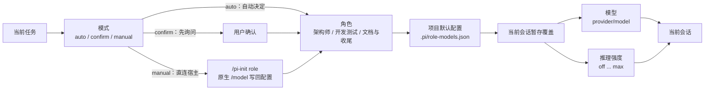

# pi-init

Pi 扩展：为项目生成 AI Coding 协作上下文，并提供角色编排。

## 功能

- 生成项目级 `AGENTS.md`、记忆文档和 `.pi/role-models.json`。
- 随 package 发布公共 `pi-init-role-routing` Skill，提供角色职责、路由和工作流规则；新项目不再生成项目级角色 Skill。
- 通过统一的 `/pi-init` 控制中心完成初始化、角色配置和模型切换。
- 根据任务在公共 Skill 定义的职责之间切换模型，项目通过 `roleModels` 映射启用角色。
- 支持 `auto`、`confirm`、`manual` 三种角色切换模式。
- 提供项目级任务工作流策略，默认 `workflowMode: "auto"`：`off` 拒绝新规划，`on` 始终编排，`auto` 对不超过 2 个任务的规划跳过编排并由当前架构角色直接顺序执行；可通过 `/pi-init config workflow` 选择。兼容旧配置中的 `workflowEnabled`，缺失 `workflowMode` 时 `true/false` 映射为 `on/off`。
- 工作流执行器默认是 `local`；可选择 `subtask`，由主会话调用 `subtask` 工具把当前任务委派到独立的对话 fork，fork 完成后把结果消息带回会话并自动推进，主会话仍拥有唯一的工作流状态。
- 未进入 `task_workflow` 的普通外部 Agent 执行会在 TUI 中显示开始时间、结束时间和总耗时报告，并与工作流任务完成报告分开。
- 自动模式在真实跨角色且上下文使用率达到 50% 时，于 agent 完全 settled 后压缩上下文并自动继续任务。
- 记录项目宿主环境和平台相关命令约定。

## 安装与启动

直接在本仓库启动扩展：

```bash
pi --no-extensions -e ./extensions/index.ts
```

然后在 Pi 中执行：

```text
/pi-init
```

可以直接从 GitHub 安装为 Pi package：

```bash
pi install https://github.com/CGOSU/pi-init
```

也可以使用 Git shorthand：

```bash
pi install git:github.com/CGOSU/pi-init
```

如果要启用 `subtask` 执行器，还需要在同一个 Pi 环境中单独安装并启用第三方扩展；pi-init 不会复制或声明该依赖：

```bash
pi install npm:pi-subtask
```

未安装该扩展时请保持 `workflowExecutor: "local"`；`subtask` 模式会在缺少工具时安全阻塞当前任务。旧配置值 `subagents` 会自动映射到 `subtask`，不会切换到已停止接入的 `@tintinweb/pi-subagents` RPC 执行器。

仅当前会话临时使用：

```bash
pi -e https://github.com/CGOSU/pi-init
```

本地开发时，也可以从当前目录安装：

```bash
pi install .
```

`init_project` 工具的 `targetDir` 默认为当前工作目录，支持 `dryRun: true` 预览而不写入文件。

### 可选：用量统计

仓库提供跨平台的 `pi-usage` 命令，用于查看 Pi 的模型用量：

Windows PowerShell：

```powershell
pwsh -File .\scripts\install-launchers.ps1
pi-usage
```

POSIX shell（Linux/macOS/WSL）：

```bash
sh ./scripts/install-launchers.sh
pi-usage
```

- `pi-usage` 默认查询 DuckDB；首次查询、距离上次检查超过 1 小时或跨自然日时，会自动扫描并增量导入 session JSONL。追加写入只读取已保存 checkpoint 之后的新字节；文件截断、改写或尾部校验失败时自动回退为全量重建。使用 `pi-usage --update` 可强制立即检查，日期参数支持 `yesterday`、`7d`/`30d`、`YYYY-MM`、单个 `YYYY-MM-DD`，以及两个日期组成的闭区间（如 `pi-usage 2026-08-01 2026-08-25`）；也可用 `--db <路径>` 指定数据库。默认数据库为 `~/.pi/agent/pi-usage.duckdb`，未安装 DuckDB 时会自动安装到用户目录。Pi fork/branch 复制的历史 entry 按稳定 entry id 跨 session 文件去重；schema v3 首次升级会事务化重建 DuckDB 派生缓存，原始 JSONL 不会修改。
- `pi-usage` 还显示活跃时长、模型等待时长和 session 跨度；Models 表按模型显示 `Avg TPS`（`输出 token 总数 / 有效生成秒数`），采用加权吞吐量而不是简单平均；没有 `pi-token-speed` 采样的历史模型显示 `--`。Overview、Models 和 Time 使用带边框的对齐表格，并额外显示按模型总 token 缩放的柱状图及整体缓存占比（`(Cache R + Cache W) / Total`）。交互终端默认使用 ANSI 颜色，设置 `NO_COLOR=1` 可关闭。活跃时长只连接间隔不超过 5 分钟的事件，避免空闲时间被计入。
- `--update` 会强制扫描 session JSONL 并更新 DuckDB 派生表；自动检查只在上述缓存过期时执行，未过期的普通查询直接读取数据库。TTY 下手动更新和首次/过期自动检查都会显示扫描、追加、重建、移除及重算日期摘要；非 TTY 保持原有报表输出，不额外写入进度信息。session 很多或首次自动安装 DuckDB 时会短暂等待。
- 更新结束后在当前 Pi 会话执行 `/reload`，或重启 Pi，使已加载扩展使用新文件。
- 安装器会把启动器放到 Pi 所在的可执行目录；POSIX 若无写权限则使用 `${XDG_BIN_HOME:-$HOME/.local/bin}`，并提示将其加入 `PATH`。
- Pi package 的 `postinstall` 会在 `pi update --extensions` 更新完成后自动刷新 `pi-usage` 启动器；如果 `pi` 不在 `PATH` 中或 npm 禁用了 lifecycle scripts，脚本会跳过并提示重新执行安装器。
- 这些辅助命令是可选工具，不会修改系统全局环境变量；换电脑时从仓库重新执行安装器即可。

## 生成内容

```text
<project-root>/
├── AGENTS.md
├── docs/
│   ├── clean-code.md
│   ├── current-state.md
│   ├── decisions.md
│   ├── session-log.md
│   └── pitfalls.md
└── .pi/
    └── role-models.json
```

初始化提供两条路径：快速路径自动读取 `package.json`、锁文件和目录名，只需一次确认；高级路径可编辑项目名称、语言、项目定位、测试命令和角色模型，不再询问 Skill 名称或 slug。当前项目初始化完成后会自动 reload。生成的 `AGENTS.md` 会引用随 package 发布的 `pi-init-role-routing` Skill，要求先读取随模板生成的 `docs/clean-code.md`，并记录当前 Pi 宿主系统、CPU 架构和平台命令约定；如果项目实际运行在 WSL、容器或远程主机，应重新执行检测。

默认模板面向 CGOSU 工作流，包含团队知识库和 Git 身份规则。其他团队使用前，请修改：

- `templates/AGENTS.md`
- `templates/en/AGENTS.md`

## 公共角色 Skill 与动态配置

`skills/pi-init-role-routing/SKILL.md` 随 pi-init package 发布，并包含 `roles/architect.md`、`roles/developer-test.md` 和 `roles/docs-commit.md`。它是职责语义和路由的唯一公共来源，不会复制到 `~/.pi/agent/skills`，脚手架也不会生成 `.pi/skills/<slug>/SKILL.md`。

项目角色和模型的唯一项目级来源是 `.pi/role-models.json` 的 `roleModels` 映射；映射中的键即启用的角色，值必须包含精确的 `provider`、`model` 和 `thinkingLevel`。保存结构使用 `schemaVersion: 2`，例如：

```json
{
  "schemaVersion": 2,
  "roleModels": {
    "architect": { "provider": "provider", "model": "model", "thinkingLevel": "max" },
    "developer-test": { "provider": "provider", "model": "model", "thinkingLevel": "max" },
    "docs-commit": { "provider": "provider", "model": "model", "thinkingLevel": "medium" }
  }
}
```

添加新角色只需两步：

1. 在项目 `.pi/role-models.json` 的 `roleModels` 中加入合法的小写角色 ID及其模型映射；
2. 在公共 Skill package 的 `roles/<role-id>.md` 增加对应职责说明，并更新 package。

运行时不维护独立角色注册表；已配置的新角色可用于菜单和工作流任务，未配置的角色不会 fallback 到其他模型。更新 package 后执行 `pi update --extensions`，再在当前会话执行 `/reload`；本地开发可重启 Pi 或重新加载本地扩展。

旧版配置中的顶层 `architect`、`developer-test` 和 `docs-commit` 字段仍会自动读取，但只有用户明确执行 `/pi-init save` 时才规范化写入 `schemaVersion: 2` 与 `roleModels`。旧项目已有的 `.pi/skills/<slug>/SKILL.md` 不会被脚手架自动删除；请人工确认内容后再删除。用户自定义的其他 Skill 同样不会被修改。

## 角色编排

公共 Skill 按交付物选择角色；默认模型映射如下：

| 角色 | 默认模型 | 推理强度 |
| --- | --- | --- |
| 架构师 | `openai-codex/gpt-5.6-sol` | `max` |
| 开发测试工程师 | `openai-codex/gpt-5.6-luna` | `max` |
| 文档与收尾工程师 | `openai-codex/gpt-5.6-luna` | `medium` |

内置角色的默认配置保存在项目的 `.pi/role-models.json`；项目也可加入其他合法角色 ID：

- `auto`：自动切换。
- `confirm`：切换前询问。
- `manual`：手动模式。阻止自动换角；原生 `/model` 切换不会被扩展回滚，并把活动角色的模型直接写回 `.pi/role-models.json`。写回需要受信任项目和活动角色，否则只提示不写文件。
- `/pi-init role` 和 `switch_role` 只切换当前会话，不写项目配置。
- `/pi-init config [角色]` 与 `/pi-init config workflow` 只暂存当前会话变更；执行 `/pi-init save`（保存角色配置）后才写入 `.pi/role-models.json`。

自动模式仅在实际跨角色且上下文使用率达到 50% 时额外触发一次压缩；压缩会保留目标、决策、进度、文件、验证结果和下一步，成功后自动继续当前任务。会话恢复时会根据当前模型和推理强度唯一匹配并恢复角色。`confirm`、`manual`、首次选角、同角色重复切换和未知上下文不会额外触发。

角色、模型和模式的关系：



用户只需记住一个入口：

```text
/pi-init
```

控制中心提供快速初始化、高级初始化、角色与模型配置、独立的工作流策略配置、角色切换和模式切换；主状态摘要会显示当前工作流策略与执行进度。熟悉命令行时也可以直接使用：

```text
/pi-init init [目录]
/pi-init advanced [目录]
/pi-init role <role-id>
/pi-init config [role-id]
/pi-init config workflow
/pi-init save
/pi-init mode <auto|confirm|manual>
```

任务工作流默认使用 `workflowMode: "auto"`。使用 `/pi-init config workflow` 在当前会话暂存 `off`、`on` 或 `auto`，执行 `/pi-init save` 后才写入项目配置；也可以直接编辑 `.pi/role-models.json` 的顶层 `workflowMode` 字段：`off` 不创建新规划，`on` 始终创建工作流，`auto` 对不超过 2 个任务的规划返回绕过提示、不持久化状态、不调度角色，超过 2 个任务才进入编排；已开始的工作流仍可查看和收尾。旧项目缺失 `workflowMode` 时，`workflowEnabled: true/false` 分别兼容为 `on/off`，两者同时存在时以 `workflowMode` 为准。

`workflowExecutor` 同样位于 `.pi/role-models.json` 顶层，默认值为 `local`，可设为 `subtask`。配置变更先只影响当前会话，执行 `/pi-init save` 后才持久化；活动工作流会持久化创建时的执行器，之后配置不会把已有工作流切换到另一执行器。

### 活动工作流中的方向变更

工作流运行期间，直接用普通自然语言描述新的方向或新增后续工作即可，不需要记忆新的命令，也不会解析固定文本格式。同一任务执行期间的连续 interactive/rpc 普通输入会按到达顺序合并为同一个带 `revisionId` 的待处理 revision，不会忽略后续指令或创建多个 revision。扩展会在当前任务完成后停在任务边界；在架构师根据完整合并指令重新规划前，旧计划中的后续任务不会先行启动。

停在重规划边界后，扩展会将工作交给架构师。架构师必须只规划未完成的后续工作，使用 `task_workflow(action="replan")` 提交新计划；只有架构角色可以应用该计划。已完成任务、完成摘要和真实验证记录保持不变，仍有效的未来任务可通过 `retainTaskIds` 保留，新任务必须使用未出现过的 ID。若需要立刻停止当前任务，继续使用既有的 `/pi-init workflow cancel` 流程，而不是依赖方向变更输入中断任务。

在 `subtask` 执行器下，方向变更同样等到当前 fork 返回结果后才进入重规划边界；pi-init 不会自动终止或重新派发运行中的 fork，也不会启动旧计划的下一个任务。运行中的 fork 由 pi-subtask 管理，必要时请人工确认其状态。

### 模型引用策略

模型安全来自角色和工作流配置中的明确引用，不维护 Provider 白名单（`1.1.0` 起移除 `providerPolicy`，旧配置中的该字段会被忽略）：

- 角色模型和 `subtask` 工作流配置使用完整 `provider/model` 引用，并要求显式引用在注册表中存在。
- 原生 Agent 子代理由 Pi 宿主决定模型；pi-init 不注入、不校验、不拦截其 `model` 参数，模糊名称和跨 Provider 解析由宿主负责。
- `subtask` fork 仍由 pi-init 管理派发、结果协议和工作流状态，不等同于原生 Agent 子代理。

历史上的 OpenRouter 意外调用曾与 Agent 子代理的模糊模型解析有关；当前项目不再在原生 Agent 边界重复实现模型路由，需要控制该行为时应配置 Pi 宿主或显式使用完整模型引用。

原生 `/model` 切换由用户自主决定，扩展不回滚、不拦截。需要使用其他 Provider 时：

- `/pi-init config [角色]`：候选列表展示全部已注册模型（含刚登录的 Provider），随时暂存，执行 `/pi-init save` 持久化。
- 直接编辑 `.pi/role-models.json` 的角色模型：保存即生效。
- 手动模式（`mode: "manual"`）：原生 `/model` 切换会把活动角色的模型直接写回 `.pi/role-models.json`。

注意取舍：完全限定的跨 Provider 引用（如 AI 主动写 `openrouter/...`）不会被拦截——如果你需要严格限制可用 Provider，应当自行在配置中只保留对应角色模型。

每个任务完成时会输出精简的任务报告，包含任务、角色、开始/结束时间、总耗时、摘要和验证结果。总耗时从任务实际进入 `in_progress` 的时间开始计算，到任务完成时间结束；旧版状态若没有开始时间，会明确显示耗时不可用，不会伪造时间。

仅当最后一个任务完成、工作流进入 `completed` 时，才会额外输出统一的精简工作流报告，包含目标、进度、任务摘要、整体开始/结束时间、总耗时和汇总验证。规划、架构审阅等待和任务之间的调度等待不计入整体执行耗时；不调用模型生成主观内容。local 与 `subtask` 执行器使用相同格式。中间任务仍只显示任务级报告，不冒充工作流整体完成。报告中的开始/结束时间使用系统本地时区，格式为 `YYYY-MM-DD HH:mm:ss±HH:MM`。

未走 `task_workflow` 的普通外部执行也会显示“普通执行时间报告”，字段包括来源、开始时间、结束时间、总耗时和计时口径。它只跟踪 `interactive` 或 `rpc` 输入，时间边界是首次 `agent_start` 到最终 `agent_settled`；这只表示本次 Agent 执行，不等同于工作流任务或业务任务完成。活动工作流、subtask 和扩展隐藏续跑不会重复生成普通记录。报告使用不进入 LLM 上下文的 session custom entry 持久化；reload、会话切换或中断时不会补造未完成记录。

`/pi-init mode`、`/pi-init role`、`switch_role` 和 `/pi-init config` 的运行时变更只影响当前会话；只有明确执行 `/pi-init save` 才会把暂存角色配置写入项目文件。Pi 原生 `/model` 和 `Shift+Tab` 仍可用于临时切换，角色自动切换以当前会话配置为准。

### subtask 顺序执行器边界

启用 `workflowExecutor: "subtask"` 后，主会话调用 `subtask` 工具把当前就绪任务顺序委派到独立的对话 fork。fork 在共享工作区运行，不创建 worktree、不并行、不合并分支、不自动提交或推送；主会话是 `task_workflow` 状态的唯一写入者，fork 不能调用该工具。派发消息（`pi-init-subtask-dispatch`）不进入 LLM 上下文，fork 的提示词内嵌严格的 `pi-init/task-result@1` 协议，结果通过 `subtask-result` custom 消息回到会话。

fork 返回的结果必须携带符合 `pi-init/task-result@1` 的严格 JSON；只有 `outcome: "complete"` 且包含真实验证记录的结果才会完成任务。无效结果、非 done 状态或缺少 `subtask` 工具都会安全阻塞任务，而不会猜测性推进。运行中的 fork 由 pi-subtask 面板管理，可在其中停止或查看；pi-init 取消或阻塞工作流时不会伪造任务完成，必要时仍需人工确认 fork 状态。

reload 不会自动重新派发非终态的已委派任务，以避免共享工作区并发写入。持久化的 delegation 只用于状态展示和人工恢复；旧配置值 `subagents`（pi-subagents RPC）自动映射到 `subtask`，但不会把工作流切换到已停止接入的 RPC 执行器。

### 工作流运行时版本不一致

如果创建工作流时看到 `(0, _roles.shouldOrchestrateWorkflow) is not a function`，说明正在运行的扩展和 `src/roles.js` 不是同一版本，通常是 Pi 仍加载旧的 Git package 或 reload 前的模块缓存。执行：

```bash
pi update --extensions
```

然后在当前 Pi 会话执行 `/reload`；本地开发直接重启 Pi，并使用同一份 `extensions/index.ts` 与 `src/roles.js`。pi-init `1.0.4` 起会把该情况转换为可操作的错误提示，不会继续以不确定的策略创建工作流。

## 全局协作规则

如果所有项目都需要遵守同一套主机规则，可使用 Pi 全局上下文文件：

```text
~/.pi/agent/AGENTS.md
```

`settings.json` 主要用于配置，不适合承载自然语言协作规则。

## 检查

```bash
npm test
```
