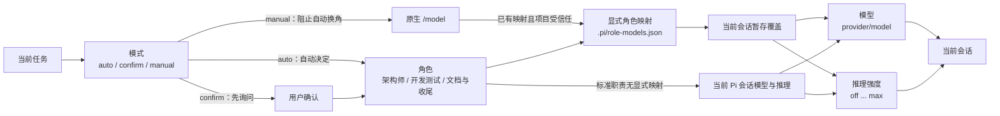

# pi-init

Pi 扩展：为项目生成 AI Coding 协作上下文，并提供角色编排。

## 功能

- 生成项目级 `AGENTS.md`、记忆文档和 `.pi/role-models.json`。
- 随 package 发布公共 `pi-init-role-routing` Skill，集中维护角色职责、路由、交接、证据门控和工作流规则；新项目不再生成项目级角色 Skill。
- 按风险分级执行：只读咨询和目标明确的低风险开发直接自主推进，不为一般技术选择、排查顺序或恢复既定行为的 bug 反复询问或交接；用户要求简单任务只做实现时，不默认运行全量测试、类型检查或构建，只保留最小必要核对并说明未执行项；复杂/高风险任务仍保留结构化证据、角色边界、真实验证和授权。
- 通过统一的 `/pi-init` 控制中心完成初始化、角色配置和模型切换。
- 根据任务在公共 Skill 定义的职责之间切换模型；项目通过 `roleModels` 映射配置显式模型并启用自定义角色，内置标准职责无映射时沿用当前会话模型。
- 支持 `auto`、`confirm`、`manual` 三种角色切换模式。
- 提供项目级任务工作流策略，默认 `workflowMode: "auto"`：`off` 拒绝新规划，`on` 始终编排，`auto` 对不超过 2 个任务的规划跳过编排，由各任务指定角色切换后直接顺序执行。`architect` 只规划且不能作为执行任务角色；plan/replan 会拒绝该角色，旧活动计划不会自动换角或派发。可通过 `/pi-init config workflow` 选择。兼容旧配置中的 `workflowEnabled`，缺失 `workflowMode` 时 `true/false` 映射为 `on/off`。
- 任务规划排序采用软约束：先遵守用户明确的优先级、截止要求和硬依赖，再安排可能推翻方案的关键未知项的限时最小验证，其次考虑业务关键路径；只有同层且风险、价值相近时才先易后难。不新增 difficulty/risk 字段，也不自动改写 task_workflow 输入顺序。
- pi-init 工作流仅在当前主会话内按顺序执行（local）；缺省配置和旧 `workflowExecutor: "local"` 配置仍可用。已退役的 Runtime 配置与持久状态不会静默回退或自动迁移，细节见“已退役的旧 Runtime 数据”。
- 未进入 `task_workflow` 的普通外部 Agent 执行会在 TUI 中显示开始时间、结束时间和总耗时报告，并与工作流任务完成报告分开。
- 统一 pi-init 活动区将角色、工作流进度、上下文压缩、可观测的模型请求/输出阶段、工具类别、缓存 token usage 和 session 累计工作时间合并到单一宽度感知信息。TUI 只显示一条位于编辑器下方的活动 widget；RPC 使用同源简明 status，JSON/print 不依赖 UI。Pi 原生 footer、working indicator 和 OSC 7501 保持原样；详细工作流原因与恢复步骤仍可从现有详情入口查看。
- 可观测性只基于公开 Provider 和工具生命周期事件：不推测 MCP/codemode 内部 I/O；未知工具以通用类别显示，不展示工具参数、命令、路径、URL 或结果。`cacheRead`/`cacheWrite` 是 Provider token usage，不代表磁盘或网络 I/O；完整有效 usage 中的正数按对应字段显示，部分/无效字段不补零或伪装为成功。Pi 1.1.0 可能已将 Provider 未报告的计数归一化为零，因此全零显示为“来源未确认”，不代表 Provider 明确报告零，也不推断缓存命中或未命中。缺失、无效 usage、请求失败、中止和缺少结束事件分别保留状态语义。
- Pi API peer dependencies：`@earendil-works/pi-ai`、`@earendil-works/pi-coding-agent`、`@earendil-works/pi-tui` 均要求 `^1.1.0`，锁文件与本地解析版本为 `1.1.0`；peer 范围声明不修改已安装的全局 Pi 版本。
- 自动模式在真实跨角色，或编排中的非最终任务完成且上下文使用率达到 50% 时，于 agent 完全 settled 后压缩上下文并继续尚未完成的工作；普通角色切换不会额外触发一个无任务回合。
- 记录项目宿主环境和平台相关命令约定。

## 安装与启动

直接在本仓库启动扩展：

```bash
pi --no-extensions -e ./extensions/index.ts
```

然后在 Pi 中执行：

```text
/pi-init
```

可以直接从 GitHub 安装为 Pi package：

```bash
pi install https://github.com/CGOSU/pi-init
```

也可以使用 Git shorthand：

```bash
pi install git:github.com/CGOSU/pi-init
```

仅当前会话临时使用：

```bash
pi -e https://github.com/CGOSU/pi-init
```

本地开发时，也可以从当前目录安装：

```bash
pi install .
```

`init_project` 工具的 `targetDir` 默认为当前工作目录，支持 `dryRun: true` 预览而不写入文件。

### 可选：用量统计

仓库提供跨平台的 `pi-usage` 命令，用于查看 Pi 的模型用量：

Windows PowerShell：

```powershell
pwsh -File .\scripts\install-launchers.ps1
pi-usage
```

POSIX shell（Linux/macOS/WSL）：

```bash
sh ./scripts/install-launchers.sh
pi-usage
```

- `pi-usage` 默认查询 DuckDB；首次查询、距离上次检查超过 1 小时或跨自然日时，会自动扫描并增量导入 session JSONL。追加写入只读取已保存 checkpoint 之后的新字节；文件截断、改写或尾部校验失败时自动回退为全量重建。使用 `pi-usage --update` 可强制立即检查，日期参数支持 `yesterday`、`7d`/`30d`、`YYYY-MM`、单个 `YYYY-MM-DD`，以及两个日期组成的闭区间（如 `pi-usage 2026-08-01 2026-08-25`）；也可用 `--db <路径>` 指定数据库。默认数据库为 `~/.pi/agent/pi-usage.duckdb`，未安装 DuckDB 时会自动安装到用户目录。Pi fork/branch 复制的历史 entry 按稳定 entry id 跨 session 文件去重；schema v3 首次升级会事务化重建 DuckDB 派生缓存，原始 JSONL 不会修改。报表会显示 DuckDB 缓存的最近更新时间（`YYYY-MM-DD HH:mm`）。
- `pi-usage` 还显示活跃时长、模型等待时长和 session 跨度；Models 表按模型显示 `Avg TPS`（`输出 token 总数 / 有效生成秒数`），采用加权吞吐量而不是简单平均；没有 `pi-token-speed` 采样的历史模型显示 `--`。Overview、Models 和 Time 使用带边框的对齐表格，并额外显示按模型总 token 缩放的柱状图及整体缓存占比（`(Cache R + Cache W) / Total`）。交互终端默认使用 ANSI 颜色，设置 `NO_COLOR=1` 可关闭。活跃时长只连接间隔不超过 5 分钟的事件，避免空闲时间被计入。
- 使用 `pi-usage [时间范围] --output <路径>` 可将查询结果输出为参照每日 AI 对账单样式的纵向 SVG 图片；时间参数与普通查询完全一致，支持 `yesterday`、`7d`/`30d`、`YYYY-MM`、单个 `YYYY-MM-DD`，以及两个日期组成的闭区间。`--output` 目前要求 `.svg` 路径，未指定时仍输出原有文本报表。图片中的费用、模型、Token、缓存命中率和会话数均来自同一份 summary；SVG 不增加图像渲染运行时依赖，也不等同于实际账单。
- `--update` 会强制扫描 session JSONL 并更新 DuckDB 派生表；自动检查只在上述缓存过期时执行，未过期的普通查询直接读取数据库。TTY 下手动更新和首次/过期自动检查都会显示扫描、追加、重建、移除、取 session 文件最新修改时间且精确到分钟的重算日期，以及受影响日期摘要；非 TTY 保持原有报表输出，不额外写入进度信息。session 很多或首次自动安装 DuckDB 时会短暂等待。
- 更新结束后在当前 Pi 会话执行 `/reload`，或重启 Pi，使已加载扩展使用新文件。
- 安装器会把启动器放到 Pi 所在的可执行目录；POSIX 若无写权限则使用 `${XDG_BIN_HOME:-$HOME/.local/bin}`，并提示将其加入 `PATH`。
- Pi package 的 `postinstall` 会在 `pi update --extensions` 更新完成后自动刷新 `pi-usage` 启动器；如果 `pi` 不在 `PATH` 中或 npm 禁用了 lifecycle scripts，脚本会跳过并提示重新执行安装器。
- 这些辅助命令是可选工具，不会修改系统全局环境变量；换电脑时从仓库重新执行安装器即可。

## 生成内容

```text
<project-root>/
├── AGENTS.md
├── docs/
│   ├── clean-code.md
│   ├── current-state.md
│   ├── decisions.md
│   ├── session-log.md
│   └── pitfalls.md
└── .pi/
    ├── role-models.json
    └── pi-init-state.json
```

初始化提供两条路径：快速路径自动读取 `package.json`、锁文件和目录名，只需一次确认；高级路径可编辑项目名称、语言、项目定位、测试命令和角色模型，不再询问 Skill 名称或 slug。当前项目初始化完成后会自动 reload。另可通过 `/pi-init sync [目录]` 安全同步已有项目的托管模板区块。生成的 `AGENTS.md` 只保留项目定位、环境、命令和知识库等项目特有规则，并引用随 package 发布的 `pi-init-role-routing` Skill；通用任务执行流程、证据门控、工具调用、角色交接和真实验证规则统一由公共 Skill 维护。它仍要求按需读取随模板生成的 `docs/clean-code.md`，并记录当前 Pi 宿主系统、CPU 架构和平台命令约定；如果项目实际运行在 WSL、容器或远程主机，应重新执行检测。

默认模板面向 CGOSU 工作流，包含团队知识库和 Git 身份规则。其他团队使用前，请修改：

- `templates/AGENTS.md`
- `templates/en/AGENTS.md`

### 模板同步与历史保留

`/pi-init sync [目录]` 用于把已有项目升级到当前模板版本，不会重新初始化或覆盖项目配置。脚手架会在 `.pi/pi-init-state.json` 中记录模板 schema 版本和托管区块基线。

- `AGENTS.md` 仅同步带有 `pi-init` 标记的托管区块；其他项目规则保持不变。
- `docs/current-state.md`、`docs/decisions.md`、`docs/session-log.md` 和 `docs/pitfalls.md` 已存在时完整保留，只在缺失时创建。
- 老项目首次同步会迁移可精确识别的 Fast Path 区块；无法确认是否为模板内容时报告冲突，不静默覆盖。
- 同步会先执行内部 `dryRun` 预览，区分新增、更新、保留和冲突；冲突时不写入文件，成功后可重复执行且不会重复插入区块。

## 公共角色 Skill 与动态配置

### 公共 Skill 的职责

`skills/pi-init-role-routing/` 随 pi-init package 一起发布，是所有项目共用的职责路由来源：

- `SKILL.md` 维护任务执行流程、证据门控、工具调用、角色边界、交接、真实验证和 `task_workflow` 规则。
- `roles/*.md` 按需提供架构师、开发测试工程师、文档与收尾工程师的职责说明；不需要的角色不会额外加载。
- Skill 只描述职责和流程，不保存具体 provider、model 或 thinkingLevel，也不会自行切换模型；`switch_role` 和扩展运行时负责按项目配置应用模型。
- 它由 Pi 从已安装的 package 加载，不复制到 `~/.pi/agent/skills`；脚手架只生成对它的引用，不生成或覆盖 `.pi/skills/<slug>/SKILL.md`。

因此，公共 Skill 负责“谁在什么边界做什么”，项目 `.pi/role-models.json` 的 `roleModels` 负责保存显式角色模型映射。内置标准角色 `architect`、`developer-test`、`docs-commit` 无需映射即可使用；自定义角色仍需显式映射和对应职责说明。既有项目的旧项目级 Skill 不会自动删除，确认内容后可手动迁移或删除。

`roleModels` 中的每个显式映射值必须包含精确的 `provider`、`model` 和 `thinkingLevel`，并优先于会话默认。保存结构使用 `schemaVersion: 2`；`roleModels` 可省略或为空，例如：

```json
{
  "schemaVersion": 2,
  "roleModels": {
    "architect": { "provider": "provider", "model": "model", "thinkingLevel": "max" },
    "developer-test": { "provider": "provider", "model": "model", "thinkingLevel": "max" },
    "docs-commit": { "provider": "provider", "model": "model", "thinkingLevel": "medium" }
  }
}
```

配置文件缺失或没有任何显式角色映射（包括 `schemaVersion: 2` 缺少 `roleModels`/映射为空且没有兼容的旧版顶层映射）时，标准职责沿用当前 Pi 会话的模型和推理强度；角色切换只改变职责，不另选模型、不生成或持久化 fallback 映射。没有当前会话模型时会报错。损坏 JSON、未知 schema、`roleModels: null`/数组、无效映射字段、显式模型不可用或凭据缺失也会如实失败，不会静默回退。

添加新角色只需两步：

1. 在项目 `.pi/role-models.json` 的 `roleModels` 中加入合法的小写角色 ID及其模型映射；
2. 在公共 Skill package 的 `roles/<role-id>.md` 增加对应职责说明，并更新 package。

运行时不维护独立角色注册表；已配置的新角色可用于菜单和工作流任务，未配置的未知自定义角色不会 fallback 到其他模型。更新 package 后执行 `pi update --extensions`，再在当前会话执行 `/reload`；本地开发可重启 Pi 或重新加载本地扩展。

旧版配置中的顶层 `architect`、`developer-test` 和 `docs-commit` 字段仍会自动读取，但只有用户明确执行 `/pi-init save` 时才规范化写入 `schemaVersion: 2` 与 `roleModels`。旧项目已有的 `.pi/skills/<slug>/SKILL.md` 不会被脚手架自动删除；请人工确认内容后再删除。用户自定义的其他 Skill 同样不会被修改。

## 角色编排

公共 Skill 按交付物选择角色；pi-init 不再为内置标准职责预设固定 provider/model 或推理强度。未显式映射的标准职责沿用当前会话模型和推理强度，显式角色映射仍优先。项目可加入其他合法角色 ID：

- `auto`：自动切换。
- `confirm`：切换前询问。
- `manual`：手动模式。阻止自动换角；原生 `/model` 切换不会被扩展回滚。只有当前活动角色已有显式映射且项目受信任时，切换才更新该映射；标准职责使用会话默认模型时不会创建固定映射。无活动角色或项目不受信任时不写文件。
- `/pi-init role` 和 `switch_role` 只切换当前会话，不写项目配置。
- `/pi-init config [角色]` 与 `/pi-init config workflow` 只暂存当前会话变更；执行 `/pi-init save`（保存角色配置）后才写入 `.pi/role-models.json`。

自动模式仅在实际跨角色，或活动工作流的非最终任务完成后且上下文使用率达到 50% 时额外触发一次压缩；检查发生在 agent 完全 settled 后，压缩会保留目标、决策、进度、文件、验证结果和下一步。角色压缩交接绑定操作 ID、目标角色、session/branch 上下文代次和当前 workflow/replan 身份；只有该次 `compact()` 的 `onComplete`/`onError` 回调能收敛，不能用无归属的 `session_compact` 事件冒认完成。角色、session、branch 或工作流身份改变后，迟到回调不续跑；压缩失败会排入不触发新 turn 的模型可见诊断，不报告成功，也不自动派发任务。工作流失败后先检查当前状态和身份，再由用户显式 resume；架构审阅状态不得被自动恢复绕过。最终任务、低于阈值、未知上下文以及 `confirm`、`manual` 模式不会因任务边界额外压缩。普通角色切换完成后不会额外唤起无任务回合。会话恢复时只按当前模型和推理强度匹配显式映射；没有唯一匹配时不猜测活动角色，仍按职责确认和恢复门处理。外部或非本次角色交接触发的 `session_compact` 会持久化“职责待恢复”标记；自动角色交接仅在绑定身份校验通过后由运行时记录 acknowledged，不要求重复切换。branch 实际变化时目标 branch 的旧 acknowledged 不再确认当前职责，必须重新确认；manual 模式无法从真实模型验证当前角色时，应由用户执行 `/pi-init role <role>`，不要循环调用 `switch_role`。恢复门解除前只允许查看工作流状态、读取文件或调用 `switch_role`，成功后才能编辑、写入、测试、执行 shell 或提交结果。new 或空会话不会额外上锁。

### 读取与探索策略

完整的读取、精确编辑、证据门控和验证规则统一遵循随 package 发布的公共 `pi-init-role-routing` Skill；README 不重复维护细节。简单只读咨询可直接由适合的非 `architect` 角色完成；目标明确的低风险开发由 `developer-test` 直接调查、实现和验证，不因普通实现选择建立工作流。需要仓库、代码、测试、文档或外部事实取证时，统一由 `docs-commit` 完成并结构化交接给 `architect`；只有业务/契约冲突、权限或凭据缺失、不可逆或外部状态操作、已有改动无法安全合并或真实验证阻塞时才询问。

`architect` 只负责思考、分析、决策、规划和安排。其运行时除 `switch_role` 与 `task_workflow(action="plan"/"replan"/"status")` 外不得调用任何工具，不得连接或调用 MCP；`read`、搜索、shell、编辑、浏览器、脚本、协作和未知工具均由运行时 fail-closed 阻断。提示层只用于降低错误率，运行时守卫仍对无效或歧义调用 fail-closed，正常合法调用不新增工具 schema 或模型调用。

角色、模型和模式的关系：


```mermaid
flowchart LR
  TASK[当前任务] --> MODE[模式<br/>auto / confirm / manual]
  MODE -->|auto：自动决定| ROLE[角色<br/>架构师 / 开发测试 / 文档与收尾]
  MODE -->|confirm：先询问| CONFIRM[用户确认]
  CONFIRM --> ROLE
  MODE -->|manual：阻止自动换角| COMMAND["原生 /model"]
  COMMAND -->|已有映射且项目受信任| CONFIG[显式角色映射<br/>.pi/role-models.json]
  ROLE --> CONFIG
  CONFIG --> OVERRIDE[当前会话暂存覆盖]
  ROLE -->|标准职责无显式映射| SESSION_DEFAULT[当前 Pi 会话模型与推理]
  OVERRIDE --> MODEL[模型<br/>provider/model]
  OVERRIDE --> THINKING[推理强度<br/>off ... max]
  SESSION_DEFAULT --> MODEL
  SESSION_DEFAULT --> THINKING
  MODEL --> SESSION[当前会话]
  THINKING --> SESSION
```

用户只需记住一个入口：

```text
/pi-init
```

控制中心提供快速初始化、高级初始化、项目模板同步、角色与模型配置、独立的工作流策略配置、角色切换和模式切换；主状态摘要会显示当前工作流策略与执行进度。熟悉命令行时也可以直接使用：

```text
/fast <任务描述>
/pi-init init [目录]
/pi-init advanced [目录]
/pi-init sync [目录]
/pi-init role <role-id>
/pi-init config [role-id]
/pi-init config workflow
/pi-init save
/pi-init mode <auto|confirm|manual>
```

`/fast <任务描述>` 是用户为本次任务显式选择 Fast Path，不设置持久开关、不修改项目配置或模型；Agent 忙碌、存在未结束工作流（running/paused/replanning）或有无法恢复的已保存工作流时仍会拒绝派发。它会跳过自动 Fast Path 的任务类型、规模和修改范围资格复核，直接按精简流程定向读取最少必要上下文、完成所需修改和风险匹配的最小验证；不会仅因自动资格不符而退回普通流程。安全、权限、需求/契约确认、职责边界、上下文恢复门、工作流保护和必要验证始终优先；任务独立要求架构规划或工作流时仍须遵循。

### 控制中心与次级菜单

`/pi-init` 在 TUI 中打开控制中心，根菜单提升为“初始化”“变更”“同步”“工作流”四个分组；选择“初始化”或“变更”后再进入对应的次级菜单，同步和工作流入口直接执行对应操作。菜单使用尽可能宽的横向区域，选中项的说明会在列表下方独立显示并自动换行，避免窄终端截断。保存不再作为列表项出现，统一使用 `Ctrl+S`（Windows 终端若拦截该组合键，可用 `F2`）；带有次级菜单的入口需要逐级完成选择：

- “变更 · 工作流策略”只配置 `workflowMode`（`off`、`on` 或 `auto`）；工作流执行固定为当前主会话内的 local 顺序执行。命令行入口 `/pi-init config workflow` 也只打开策略菜单。
- 在任一次级菜单选择“返回”或按 `Esc`，都会返回上一级且取消本次尚未完成的配置选择；完成选择后，变更先暂存于当前会话。
- 在任一角色配置菜单中按 `Ctrl+S` 或 `F2`，会保存当前暂存的角色配置；保存完成或失败后仍停留在当前菜单，重复按键不会并发写入。
- `Ctrl+S` 和 `F2` 覆盖控制中心、角色与模型、模式、工作流策略、角色选择、模型搜索和推理强度等层级；初始化表单仍使用 `Enter` 确认、`Esc` 返回。
- 执行 `/pi-init save` 仍是非 TUI 和兼容场景的显式保存入口。

### 架构前置证据与职责边界

角色路由遵循公共 Skill 的单一层级：明确实现/测试直接交给 `developer-test`，明确文档、版本或 Git 收尾直接交给 `docs-commit`，不明确、含糊或跨职责的指令从 `architect` 开始。简单只读咨询可直接由适合的非 `architect` 角色完成；凡需要仓库、代码、测试、文档或外部事实取证，均由 `docs-commit` 完成并交接包含事实、来源、相关符号、调用/依赖、测试、工作区状态、风险和未确认项的结构化证据包。`architect` 只消费证据，负责思考、分析、决策、规划和安排，除 `switch_role` 与 `task_workflow` 的 `plan`/`replan`/`status` 外不调用工具、不连接 MCP；实现完成并验证后，只有产生文档、版本或 Git 收尾时才交给 `docs-commit`。

当公共 Skill 或扩展更新后，已安装的 package 和当前 Pi 进程不会自动获得新规则；请执行 `pi update --extensions`，然后 `/reload` 或重启 Pi。新守卫只在扩展重新加载后生效。当前仓库源码的修改不会自动覆盖已安装 Git package；本次退役未执行安装、`pi update --extensions`、reload、真实 Pi E2E、提交或推送。

任务工作流默认使用 `workflowMode: "auto"`。使用 `/pi-init config workflow` 在当前会话暂存 `off`、`on` 或 `auto`，执行 `/pi-init save` 后才写入项目配置；也可以直接编辑 `.pi/role-models.json` 的顶层 `workflowMode` 字段：`off` 不创建新规划，`on` 始终创建工作流，`auto` 对不超过 2 个任务的规划返回绕过提示、不持久化状态、不调度角色，并要求按各任务指定角色切换后直接顺序执行，架构角色不直接实现；超过 2 个任务才进入编排。所有 pi-init 工作流都在当前主会话内 local 顺序执行。缺省配置及旧 `workflowExecutor: "local"` 配置仍可用，但执行器不再作为菜单或 schema 选项；旧项目缺失 `workflowMode` 时，`workflowEnabled: true/false` 分别兼容为 `on/off`，两者同时存在时以 `workflowMode` 为准。

#### 已退役的旧 Runtime 数据

旧配置中的顶层 `runtime` 字段返回 `RUNTIME_CONFIG_RETIRED`，`workflowExecutor: "runtime"` 返回 `WORKFLOW_EXECUTOR_RETIRED`；请由用户检查并手动清理这些旧配置后再保存，不会自动忽略或改写。含 Runtime executor/authority 的历史 workflow session entry 会以 `WORKFLOW_STATE_RUNTIME_RETIRED` 在状态与动作入口报告恢复失败；pi-init 不会把它本地重放、自动迁移、改写或删除。请保留原始 entry，并由用户自行决定如何处理旧 session。当前未接入任何官方 Runtime 接口。

#### 工作流交接与恢复边界

工作流状态使用 Pi 扩展公开的 `appendEntry` 写入当前 session，并在 `session_start`/`session_tree` 从活动 branch 恢复。该能力持久化的是 pi-init 的工作流记录，不是 AgentHarness durable operation API；`appendEntry`/`sendMessage` 的公开契约不提供事务、fsync 或外部副作用 exactly-once 保证。工作流继续由 `task_workflow` 唯一负责计划、依赖、阻塞、验收和重规划，Pi turn 结束或消息已排队都不代表业务任务已完成。`architect` 不能作为执行任务角色，complete/block 只能由匹配的非 architect 执行角色调用；发现旧计划违反该约束时不会自动改写角色或派发，需先检查并显式取消该旧工作流，再另建计划。

创建工作流时会生成 `workflowId`、`planVersion`、当前 `sessionId` 与 `recoveryGeneration`；后续变更工具必须匹配当前基础身份。任务 `complete`/`block` 还须匹配当前 `taskId`、`attemptId` 和 `handoffId`，重规划还须匹配当前 `revisionId` 与 `handoffId`。这些身份由当前任务/重规划交接提供，缺失、旧 branch 或不匹配的身份会被拒绝，不从任务文本补齐。恢复时尚未派发的准备阶段可安全续接；已派发或已启动但无业务验收结果的任务会暂停为“结果未知”，不得自动重放。核对外部副作用后，用户可显式执行 `/pi-init workflow retry <taskId> --confirm-unknown-outcome` 创建新 attempt；这不是 exactly-once 或撤销既有副作用的保证。旧 local 状态可读取；缺少执行身份的 legacy `in_progress` 会暂停待核对，原 session entry 不原地改写，旧 Runtime 状态仍 fail-closed。

工作流状态、单任务完成、工作流最终完成和普通执行计时分别由只读类型视图提供数据，并由纯文本与 TUI renderer 输出，不依据中文标题或已格式化文本推断类别。状态视图同时供状态文本、状态栏、进度面板及非暂停的 `task_workflow` 结果使用；进度面板的刷新与任务选择仍由运行层负责。完成报告保持中间任务精简、最终报告只展示明确的最终任务和整体耗时，验证只列明确失败项；计时缺失会显示不可用而非伪装成零。

TUI 所需的 `workflowPresentation` 只附加在当前工具结果 `details` 中，不写入 `WorkflowState` 或 session entry；缺少展示元数据的旧结果保留原始工具文本。模型侧既有内容仍由纯文本 formatter 提供。

工作流动作失败时，工具仍向模型返回 `[PI-INIT_WORKFLOW_ERROR]` 下的结构化 JSON，`isError` 状态、身份守卫和失败行为保持不变；TUI 结果 renderer 对诊断先做窄化校验，再按类别、代码、原因、白名单身份差异及安全下一步分段显示。普通错误、损坏 JSON 和不符合字段要求的诊断以真实原文回退；未通过解析的输入不会被当作成功或无数据。此层只改变 TUI 展示，不替换模型诊断或触发自动重试。

### 活动工作流中的方向变更

工作流运行期间，直接用普通自然语言描述新的方向或新增后续工作即可，不需要记忆新的命令，也不会解析固定文本格式。同一任务执行期间的连续 interactive/rpc 普通输入会按到达顺序合并为同一个带 `revisionId` 的待处理 revision，不会忽略后续指令或创建多个 revision。扩展会在当前任务完成后停在任务边界；在架构师根据完整合并指令重新规划前，旧计划中的后续任务不会先行启动。

停在重规划边界后，扩展会将工作交给架构师。架构师必须只规划未完成的后续工作，使用 `task_workflow(action="replan")` 提交新计划；只有架构角色可以应用该计划。已完成任务、完成摘要和真实验证记录保持不变，仍有效的未来任务可通过 `retainTaskIds` 保留，新任务必须使用未出现过的 ID。若需要立刻停止当前任务，继续使用既有的 `/pi-init workflow cancel` 流程，而不是依赖方向变更输入中断任务。

### 模型引用策略

模型安全来自角色和工作流配置中的明确引用，不维护 Provider 白名单（`1.1.0` 起移除 `providerPolicy`，旧配置中的该字段会被忽略）：

- 显式角色模型映射使用完整 `provider/model` 引用，并要求显式引用在注册表中存在；标准职责无显式映射时直接沿用当前会话模型。
- 原生 Agent 子代理由 Pi 宿主决定模型；pi-init 不注入、不校验、不拦截其 `model` 参数，模糊名称和跨 Provider 解析由宿主负责。
历史上的 OpenRouter 意外调用曾与 Agent 子代理的模糊模型解析有关；当前项目不再在原生 Agent 边界重复实现模型路由，需要控制该行为时应配置 Pi 宿主或显式使用完整模型引用。

原生 `/model` 切换由用户自主决定，扩展不回滚、不拦截。需要使用其他 Provider 时：

- `/pi-init config [角色]`：候选列表展示全部已注册模型（含刚登录的 Provider），随时暂存；在 TUI 配置菜单中按 `Ctrl+S`，或执行 `/pi-init save`，即可持久化。
- 直接编辑 `.pi/role-models.json` 的角色模型：保存即生效。
- 手动模式（`mode: "manual"`）：原生 `/model` 切换保留宿主行为；只有活动角色已有显式映射且项目受信任时才更新该映射。使用会话默认模型的标准职责不会因手动切换而生成固定映射。

注意取舍：完全限定的跨 Provider 引用（如 AI 主动写 `openrouter/...`）不会被拦截——如果你需要严格限制可用 Provider，应当自行在配置中只保留对应角色模型。

每个中间任务完成时只输出该任务的精简报告：任务、摘要、实现原因、耗时和验证。`implementationRationale` 必须由执行角色说明采用该实现的原因和关键取舍，不能重复摘要。验证结果只显示明确失败的验证项；成功项不显示，没有失败项时省略验证行，不再输出灰色 bullet 辅助项。完整 verification 仍保存在工作流状态中。

工作流暂停时，自动暂停通知和 `task_workflow block` 工具结果使用分区摘要，突出暂停状态、阻塞任务、真实原因及恢复建议；结果收起时不以成功标记呈现，展开后才显示完整任务和身份技术状态。通知与 TUI 由同一结构化暂停视图分别渲染，不从已格式化文案反推结构。结果未知时必须先核对外部副作用，再显式确认 retry；block 工具以结果展示为反馈，不另发重复 toast。显式 `task_workflow status`/TUI 查询与持久化状态仍保留完整任务、摘要和细节。

仅当最后一个任务完成、工作流进入 `completed` 时，才输出一次工作流完成报告：目标、进度、最终任务的摘要/实现原因/验证，以及整体开始/结束时间和总耗时；不会重新汇总前序任务。最终任务验证同样只显示明确失败的验证项。这样可以保留最终交付的完整上下文，同时避免任务报告和工作流报告重复。规划、架构审阅等待和任务之间的调度等待不计入整体执行耗时；不调用模型生成主观内容。报告中的开始/结束时间使用系统本地时区，格式为 `YYYY-MM-DD HH:mm:ss±HH:MM`。

未走 `task_workflow` 的普通外部执行仍会显示每轮独立的“普通执行时间报告”，字段包括来源、开始时间、结束时间和总耗时。另在 TUI 中，Pi 工作时显示原生 `Working`；空闲后在编辑器上方显示类似 `─ Worked for 1h 17m 49s ─` 的横向分隔线，其数值累计本次 session 的 Agent 实际工作时间，不包含闲置时间。session 恢复时优先从每轮完成后保存的独立累计快照恢复，并兼容只有普通执行记录的旧 session；活动工作流、扩展隐藏续跑和中断不会重复生成普通报告。

`/pi-init mode`、`/pi-init role`、`switch_role` 和 `/pi-init config` 的运行时变更只影响当前会话；TUI 配置菜单可按 `Ctrl+S` 保存暂存角色配置，非 TUI 或兼容场景仍使用 `/pi-init save`。Pi 原生 `/model` 和 `Shift+Tab` 仍可用于临时切换，角色自动切换以当前会话配置为准。

### 工作流运行时导出函数缺失

若遇到历史符号 `shouldOrchestrateWorkflow` 或当前工作流符号 `validateWorkflowExecutionRoles`、`workflowActionIdentity` 不是函数，不要直接断定是模块缓存、旧 package 或某种更新步骤导致。当前源码已将 `src/roles.js` 等实现迁为 `.ts`；静态 Jiti 调度测试和 Pi 1.1.0 隔离 RPC 冷启动均通过，但无法检查先前报错的长驻 Pi 进程，因此其根因仍未确认。新进程通过不代表旧进程已修复，`/reload` 也未被验证为根因修复。准确的现象、证据和未确认项见 [`docs/pitfalls.md`](docs/pitfalls.md)。

## 全局协作规则

如果所有项目都需要遵守同一套主机规则，可使用 Pi 全局上下文文件：

```text
~/.pi/agent/AGENTS.md
```

`settings.json` 主要用于配置，不适合承载自然语言协作规则。

## 检查与 TypeScript 源码

```bash
npm run typecheck
npm test
npm run check:large-files
```

`npm run typecheck` 运行 `tsc --noEmit`，以 `strict`、`NodeNext` 检查 `extensions/**/*.ts` 与 `src/**/*.ts`；`allowJs` 为 `false`，保留的 `scripts/` 和 `test/` JavaScript 不在 TypeScript 检查范围内。`npm test` 运行 Node 测试，不把文件行数作为硬门禁。`npm run check:large-files` 手动报告超过 500 行的结构审阅候选；超限本身不失败，真实扫描错误仍以非零退出。Pi 扩展在会话启动时建立基线，并在文件工具结果与 Agent 回合边界补扫；首版覆盖 `.js`、`.mjs`、`.cjs`、`.ts`、`.mts`、`.cts`、`.tsx` 和 `.jsx`。候选按项目、路径、内容指纹与策略版本跟踪，同一 session branch 恢复；内容变化后重新待审。记录结论前必须完整读取当前版本并给出有理由的保留或拆分建议；不自动修改代码，扫描、读取或持久化失败不会伪装成已审。TypeScript ESM 源码不经构建直接由 Node/Pi jiti 加载，不生成 `dist`，也不要求 `tsx` 或 `ts-node`。本轮验证使用 Node v24.14.1 与 Pi 1.1.0；Node `>=22.19.0` 的最低声明版本尚未单独实测。
